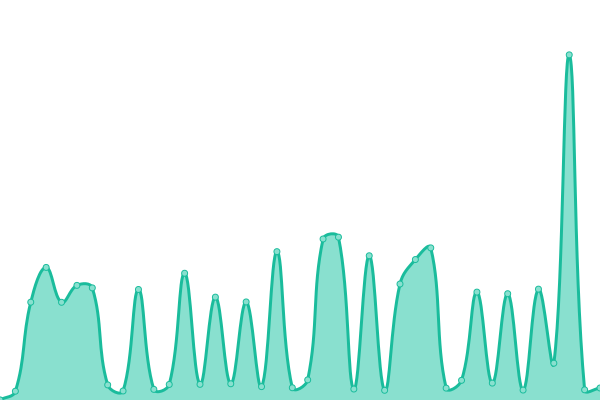

# [📈 Live Status](https://mitranbit.github.io/Uptime): <!--live status--> **🟧 Partial outage**

This repository contains the open-source uptime monitor and status page for [mitraNBIT](https://demo.upptime.js.org), powered by [Upptime](https://github.com/upptime/upptime).

With [Upptime](https://upptime.js.org), you can get your own unlimited and free uptime monitor and status page, powered entirely by a GitHub repository. We use [Issues](https://github.com/mitraNBIT/Uptime/issues) as incident reports, [Actions](https://github.com/mitraNBIT/Uptime/actions) as uptime monitors, and [Pages](https://demo.upptime.js.org) for the status page.

<!--start: status pages-->
<!-- This summary is generated by Upptime (https://github.com/upptime/upptime) -->
<!-- Do not edit this manually, your changes will be overwritten -->
<!-- prettier-ignore -->
| URL | Status | History | Response Time | Uptime |
| --- | ------ | ------- | ------------- | ------ |
|  MSK-L2 | 🟥 Down | [msk-l2.yml](https://github.com/mitraNBIT/Uptime/commits/HEAD/history/msk-l2.yml) | 

 577ms
     
 | 

<a href="https://mitraNBIT.github.io/Uptime/history/msk-l2">40.13%</a>
    

|  [Main OS](https://os.mitramanikhanal.com.np) | 🟥 Down | [main-os.yml](https://github.com/mitraNBIT/Uptime/commits/HEAD/history/main-os.yml) | 

 1227ms
     
 | 

<a href="https://mitraNBIT.github.io/Uptime/history/main-os">99.39%</a>
    

|  [Wikipedia](https://en.wikipedia.org) | 🟩 Up | [wikipedia.yml](https://github.com/mitraNBIT/Uptime/commits/HEAD/history/wikipedia.yml) | 

 236ms
     
 | 

<a href="https://mitraNBIT.github.io/Uptime/history/wikipedia">100.00%</a>
    

|  [VividCraft](https://vividcraft.com.au) | 🟥 Down | [vivid-craft.yml](https://github.com/mitraNBIT/Uptime/commits/HEAD/history/vivid-craft.yml) | 

 1702ms
     
 | 

<a href="https://mitraNBIT.github.io/Uptime/history/vivid-craft">99.21%</a>
    

|  [CareFullyPlanned LandingPage](https://www.carefullyplanned.com.au) | 🟩 Up | [care-fully-planned-landing-page.yml](https://github.com/mitraNBIT/Uptime/commits/HEAD/history/care-fully-planned-landing-page.yml) | 

 167ms
     
 | 

<a href="https://mitraNBIT.github.io/Uptime/history/care-fully-planned-landing-page">100.00%</a>
    

|  [CareFullyPlanned App](https://app.carefullyplanned.com.au) | 🟩 Up | [care-fully-planned-app.yml](https://github.com/mitraNBIT/Uptime/commits/HEAD/history/care-fully-planned-app.yml) | 

 231ms
     
 | 

<a href="https://mitraNBIT.github.io/Uptime/history/care-fully-planned-app">100.00%</a>
    

|  [INS-PC](https://rdp.nipponschoolnepal.com) | 🟩 Up | [ins-pc.yml](https://github.com/mitraNBIT/Uptime/commits/HEAD/history/ins-pc.yml) | 

 1019ms
     
 | 

<a href="https://mitraNBIT.github.io/Uptime/history/ins-pc">79.34%</a>
    

|  MSK | 🟩 Up | [msk.yml](https://github.com/mitraNBIT/Uptime/commits/HEAD/history/msk.yml) | 

 908ms
     
 | 

<a href="https://mitraNBIT.github.io/Uptime/history/msk">100.00%</a>
    

<!--end: status pages-->

[**Visit our status website →**](https://mitranbit.github.io/Uptime)
